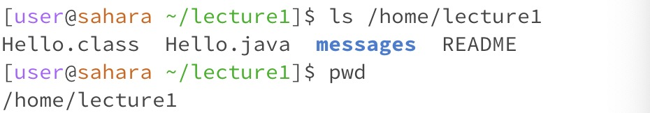

#### 1.Share an example of using the command with no arguments.
  - command ==cd== with no arguments.

  The working directory is /home. No arguments means ... It's not an error. 

  - command <mark>ls</mark> with no arguments.

  The working directory is /home. No arguments means ... It's not an error. 

  - command <mark>cat<mark> with no arguments.

  The working directory is /home. No arguments means ... It is an error because using command <mark>cat<mark> with no arguments will crash the class.

#### 2.Share an exmaple of using the command with a path to a directory as an argument.
  - command <mark>cd<mark> with a path to a directory as an argument.

  The working directory is /home/lecture1. command <mark>cd<mark> is used to change the currect dicrectory to given path-lecture1. It's not an error.
  
  - command <mark>ls<mark> with a path to a directory as an argument.

  The working directory is /home/lecture1. command <mark>ls<mark> is used to list the folders and files in the given path-lecture1. It's not an error.
  
  - command <mark>cat<mark> with a path to a directory as an argument.

  The working directory is /home/lecture1. command <mark>cat<mark> is used to print the content in the given path-lecture1. It is an error because commnad <mark>cat<mark> can't be applied to directory, and lecture1 is a directory. 

#### 3.Share an example of using the command with a path to a file as an argument.
  - command <mark>cd<mark> with a path to a file as an argument.

  The working directory is /home/lecture1/messages. command <mark>cd<mark> is used to change the currect dicrectory to given path, and here we try to access to the file-en-us.txt, which does not work. Therefore, it is an error.
  
  - command <mark>ls<mark> with a path to a file as an argument.

  The working directory is /home/lecture1/messages. command <mark>ls<mark> is used to list the folders and files in the given path, and here we try to list the content in the fileen-us.txt. It's not an error.
  
  - command <mark>cat<mark> with a path to a file as an argument.

  The working directory is /home/lecture1/messages. command <mark>cat<mark> is used to print the content in the given path, trying to print the content in the file-en-us.txt. Inside en-us.txt, we have content "Hello World!". It's not an error.

